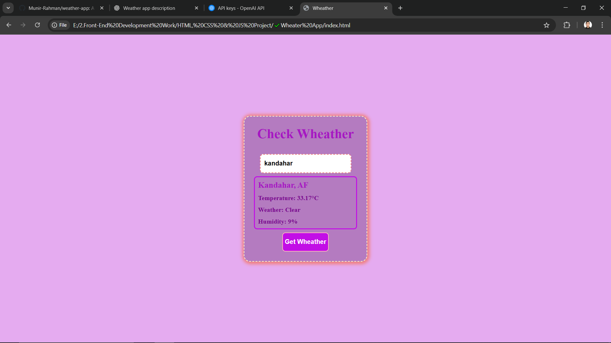

# 🌤️ Weather App

A simple and responsive Weather Application that fetches real-time weather data using the **OpenWeatherMap API**. Users can search any city to see the current temperature, weather conditions, humidity, and more.

---

## 📸 Demo


[Live Demo Link – optional if deployed on Vercel, Netlify, etc.]

---

## 🚀 Features

- 🔍 Search weather by city name
- 🌡️ Real-time temperature and weather status
- 💧 Humidity, wind speed, and condition icons
- 🌐 Responsive UI for mobile and desktop
- ⚠️ Error message for invalid or empty city input

---

## 🛠️ Built With

- HTML5  
- CSS3  
- JavaScript (Vanilla)  
- OpenWeatherMap API

---

## 📦 Installation

```bash
git clone https://github.com/yourusername/weather-app.git
cd weather-app
```

## 🙋‍♂️ Author
Munir Rahman
Front-End Web Developer
#LinkedIn – https://af.linkedin.com/in/munir-rahman-rahmani-9a9149350 | #Email – munirrahmanrahmani0@gmail.com

---

Let me know if your app has **Geolocation**, **Dark Mode**, or a **5-day forecast**, and I’ll update the README to include that too.

